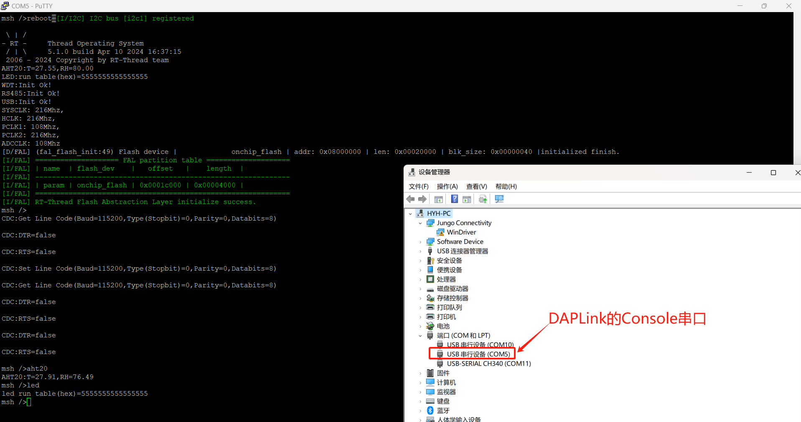

# 说明

基于[rt-thread](https://www.rt-thread.org)的模板。

# 硬件

| 硬件名称 | 说明                                                         |
| -------- | ------------------------------------------------------------ |
| Console  | 采用UART1，默认参数115200 8N1，与DAPLink的串口相连。可通过DAPLink的串口进行一些交互操作。 |
| RS485    | 采用UART2，默认参数9600 8N1，使用软件控制RS485的收发转换。   |
| LED      | 采用PA0,运行指示灯                                           |
| AHT20    | 采用软件I2C(PB8-SCK、PB9-SDA),温湿度检测。                   |
| USB      | 采用USB接口,无需DP无需1.5K上拉电阻(使用芯片内置上拉电阻)     |

# 截图

