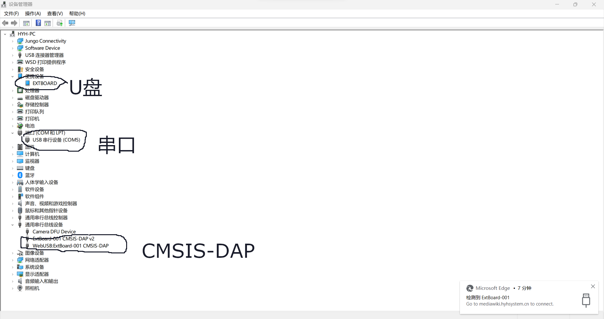
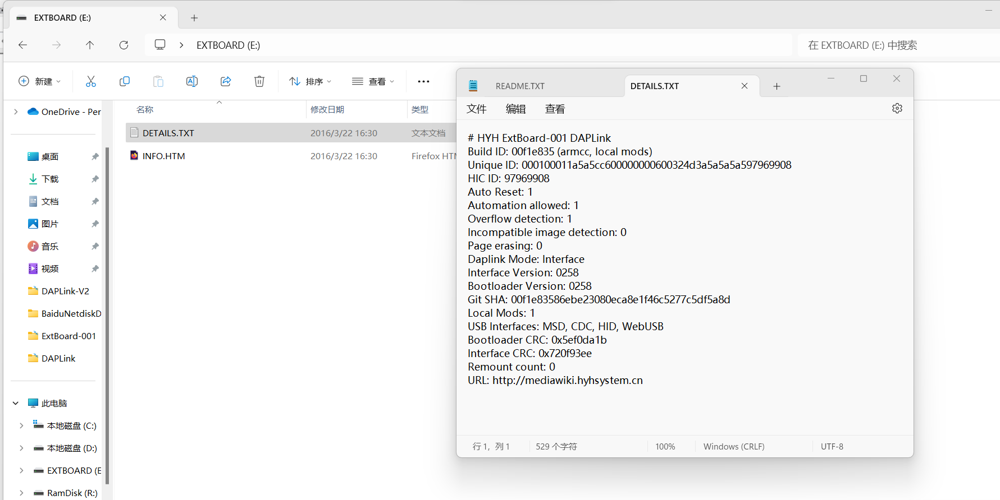

# 说明

本固件采用 合宙的[DAPLink](https://wiki.luatos.com/chips/air32f103/daplink.html)修改而来,主要修改内容如下:

- 修改厂商信息与产品信息以便通过程序识别板子的插入。
- 修改各种描述信息。

原源代码:[https://gitee.com/openLuat/daplink](https://gitee.com/openLuat/daplink)

# 文件说明

- [daplink_v2_HYH_ExtBoard-001_bl.hex](daplink_v2_HYH_ExtBoard-001_bl.hex)：bootloader程序,可通过其它烧录器(如Jlink、CMSIS-DAP)烧录。
- [daplink_v2_HYH_ExtBoard-001_iap.hex](daplink_v2_HYH_ExtBoard-001_iap.hex)：应用程序，可通过bootloader烧录，也可通过其它烧录器烧录。

注意:以上文件均需要烧录,一般是先烧录bootloader再烧录应用程序。

