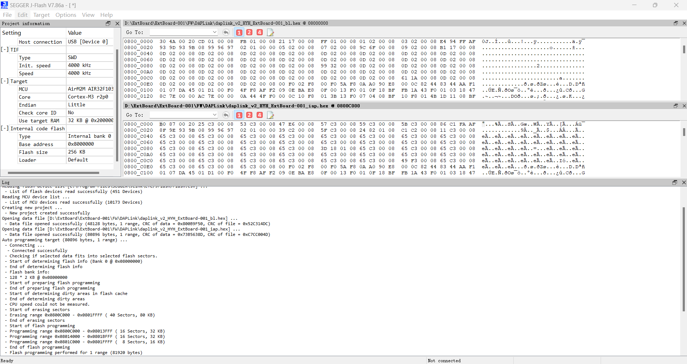

# 固件列表

- [DAPLink](DAPLink):定制化DAPLink固件。适用于ExtBoard-001的DAPLink部分,一般只需要烧写一次。

# 工具

支持的操作系统:

- Windows 10及更新版本

注意:较老版本的系统可能出现驱动问题。关于驱动问题的具体信息参见[DAPLink](DAPLink)。

## Keil MDK5

MDK5为集成开发环境，可对MCU的程序进行编译、调试等

为支持使用CMSIS-DAP，MDK5的最低版本为5.29。

### Air32F103

为支持Air32F103程序的编译调试，需要安装相应的设备支持包。

设备支持包下载地址:[https://gitee.com/openLuat/luatos-soc-air32f103/tree/master/AIR_Jlink_Keil](https://gitee.com/openLuat/luatos-soc-air32f103/tree/master/AIR_Jlink_Keil),文件后缀名为.pack,在安装好MDK5

双击即可安装。

默认情况下,固件开发时使用[Keil.AIR32F103_DFP.1.1.9.pack](https://gitee.com/openLuat/luatos-soc-air32f103/blob/master/AIR_Jlink_Keil/Keil.AIR32F103_DFP.1.1.9.pack)作为设备支持包。

## GCC

主要是在开发[RT-Thread](https://www.rt-thread.org/)时使用scons命令直接编译时使用。

一般情况下，使用RT-Thread Env自带的编译工具链。

## JLink

本工程主要使用JLink烧录DAPLink的固件程序（尤其是bootloader）。

JLink一般作为各种集成开发环境的附属组件。

本工程主要使用JLink的JFlash组件，因此需要从[https://www.segger.com/downloads/jlink/](https://www.segger.com/downloads/jlink/)下载安装。

JLink安装完成后，需要添加对Air32F103的支持,具体参考[https://gitee.com/openLuat/AirMCU-Jlink.git](https://gitee.com/openLuat/AirMCU-Jlink.git)

