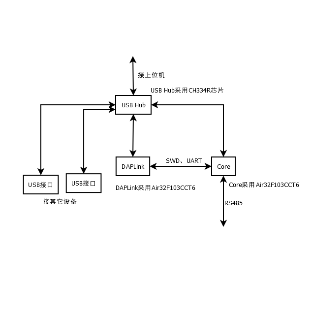

# 说明

采用Linux的系统功能强大，环境复杂,一般启动(重启)较慢。

微控制器(MCU)功能简单，运行稳定,一般启动(重启)较为迅速。

本工程主要用于以[Linux](https://www.kernel.org)内核的系统的外设扩展,借鉴PC平台的通道概念,采用MCU作为类似通道处理机的功能，允许将部分任务交给MCU处理。主要有以下特点:

- 采用USB与上位机连接。
- 外设扩展板的程序(处理机)随时可更新。
- 上位机可监控处理机的运行状态。

# 结构

## DAPLink

DAPLink采用的MCU型号为Air32F103CCT6。

DAPLink的程序需要通过其它烧录器(如Jlink、CMSIS-DAP)烧录。

## Core

DAPLink采用的MCU型号为Air32F103CCT6。

开发过程中无需其它调试器，直接使用板载的DAPLink即可。

Core的程序可通过DAPLink升级烧录，并且Core可通过DAPLink自带的串口显示信息。

Core可通过以下方法与上位机通信:

- DAPLink的串口
- USB

# 目录结构

- [HW](HW):硬件设计。
- [FW](FW):固件设计,一般用于硬件的相关MCU。
- [SOFT](SOFT):运行上位机的相关软件。