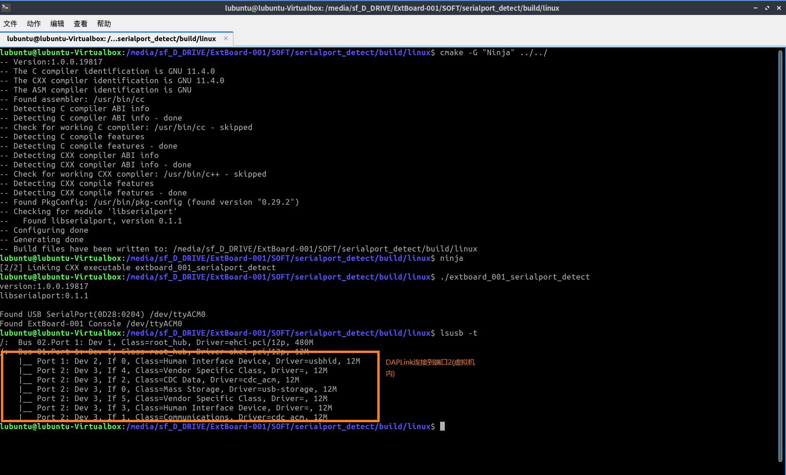
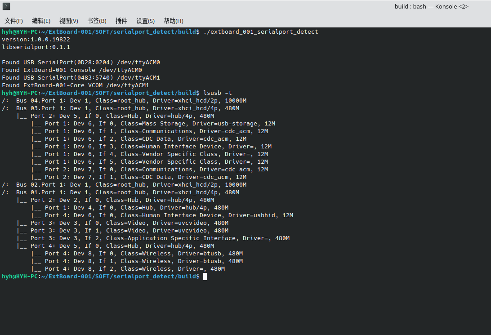

# 说明

本程序主要用于检测USB串口的串口号。

主要依赖以下第三方库:

- [libserialport](https://sigrok.org/wiki/Libserialport):跨平台串口库。

注意:Windows下驱动环境复杂，结果可能不稳定。

# 编译

本程序采用[CMake](https://cmake.org)管理构建。

# 截图

## ubuntu(虚拟机)测试

## ubuntu测试（Core固件编号001）

