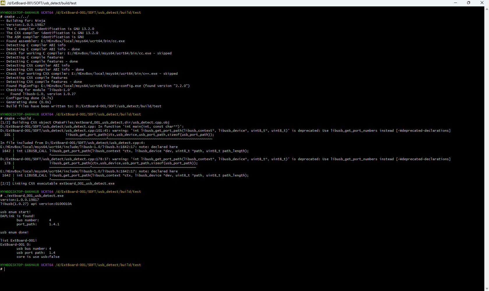

# 说明

本程序用于检测ExtBoard-001的存在。

主要依赖以下第三方库:

- [libusb-1.0](https://libusb.info/):提供通用的USB设备访问方式的C库

注意:由于需要打开USB设备读取信息，可能需要一定的特权。如果确认硬件正常但读取不到信息，尝试使用特权运行测试程序(在Windows上使用管理员权限，在Linux上使用root权限)。

# 编译

本程序采用[CMake](https://cmake.org)管理构建。

# 截图

